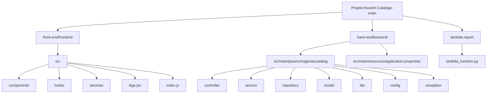

# 🎮 GameVault — Catálogo de Jogos na AWS

Projeto full-stack desenvolvido para cadastro, listagem, edição, remoção e consulta de jogos digitais. A aplicação foi construída com **React** no frontend, **Java Spring Boot** no backend, **PostgreSQL no Amazon RDS** para persistência dos dados e serviços da **AWS** para publicação e integração da solução.

---

## 👥 Integrantes do Grupo

| Nome | RA | Responsabilidade principal |
|---|---:|---|
| Daniel Bartels de Carli | 10436801 | Conexão geral da aplicação, integração entre serviços e configuração do RDS e Lambda |
| Magno Rogério de Oliveira Júnior | 10439896 | Configuração do API Gateway e rotas de integração |
| Luiz Filipe Batista dos Santos | 10438938 | Desenvolvimento do Frontend e Backend |

---

## 📌 Objetivo do Projeto

O objetivo do GameVault é disponibilizar uma aplicação web de catálogo de jogos, permitindo que o usuário gerencie registros de jogos com informações como título, gênero, desenvolvedora, publicadora, plataforma, preço, avaliação, data de lançamento e disponibilidade.

Além da aplicação principal, o projeto também possui uma funcionalidade de relatório integrada com AWS Lambda, permitindo consultar estatísticas gerais do catálogo.

---

## 🧱 Tecnologias Utilizadas

### Frontend

- React 18
- JavaScript
- HTML e CSS
- Docker

### Backend

- Java
- Spring Boot
- Spring Web
- Spring Data JPA
- Hibernate
- PostgreSQL Driver
- Docker

### Banco de Dados

- Amazon RDS
- PostgreSQL

### AWS

- Amazon VPC
- Subnets públicas e privadas
- Security Groups
- Amazon EC2
- Elastic IP
- Amazon RDS PostgreSQL
- Amazon API Gateway
- AWS Lambda
- NAT Gateway
- Internet Gateway

---

## 🗂️ Estrutura de Pastas da Aplicação

```text
Projeto-Nuvem-Catalogo-main/
├── back-end/
│   └── backend/
│       ├── Dockerfile
│       ├── pom.xml
│       └── src/
│           └── main/
│               ├── java/
│               │   └── com/gamescatalog/
│               │       ├── GamesCatalogApplication.java
│               │       ├── config/
│               │       │   ├── CorsConfig.java
│               │       │   └── DataSeeder.java
│               │       ├── controller/
│               │       │   └── GameController.java
│               │       ├── dto/
│               │       │   └── GameDTO.java
│               │       ├── exception/
│               │       │   ├── GlobalExceptionHandler.java
│               │       │   └── ResourceNotFoundException.java
│               │       ├── model/
│               │       │   └── Game.java
│               │       ├── repository/
│               │       │   └── GameRepository.java
│               │       └── service/
│               │           └── GameService.java
│               └── resources/
│                   └── application.properties
│
├── front-end/
│   └── frontend/
│       ├── Dockerfile
│       ├── package.json
│       ├── package-lock.json
│       ├── public/
│       │   └── index.html
│       └── src/
│           ├── App.jsx
│           ├── App.css
│           ├── index.js
│           ├── components/
│           │   ├── ConfirmDialog.jsx
│           │   ├── JogoCard.jsx
│           │   ├── JogoDetalhes.jsx
│           │   ├── JogoModal.jsx
│           │   └── Report.jsx
│           ├── hooks/
│           │   └── useJogos.js
│           └── services/
│               └── jogoService.js
│
├── lambda-report/
│   └── lambda_function.py
│
├── .gitignore
└── README.md
```

---

## 🧩 Diagrama da Arquitetura das Pastas



---


## 🔄 Fluxo de Funcionamento

1. O usuário acessa a aplicação pelo navegador.
2. O frontend em React apresenta a interface do catálogo de jogos.
3. Ao listar, cadastrar, editar ou remover um jogo, o frontend envia requisições HTTP para a API.
4. O API Gateway recebe as requisições e encaminha para o backend.
5. O backend Spring Boot executa as regras de negócio e acessa o banco PostgreSQL no Amazon RDS.
6. Para relatórios, a rota `/report` aciona a função Lambda.
7. A Lambda consulta os dados do backend e retorna as estatísticas processadas.

---

## 💻 Frontend

O frontend foi desenvolvido com React e é responsável pela interface visual da aplicação.

### Principais responsabilidades

- Exibir a lista de jogos cadastrados.
- Permitir busca e consulta dos jogos.
- Abrir modal para cadastro e edição.
- Exibir detalhes de um jogo.
- Solicitar confirmação antes de excluir registros.
- Exibir relatório da aplicação.
- Consumir os endpoints do backend utilizando Axios.

### Principais arquivos

| Arquivo | Função |
|---|---|
| `App.jsx` | Componente principal da aplicação |
| `App.css` | Estilização geral da interface |
| `components/JogoCard.jsx` | Card de apresentação de cada jogo |
| `components/JogoModal.jsx` | Modal de cadastro e edição |
| `components/JogoDetalhes.jsx` | Exibição detalhada de um jogo |
| `components/ConfirmDialog.jsx` | Confirmação antes da exclusão |
| `components/Report.jsx` | Tela/área de relatório |
| `hooks/useJogos.js` | Hook para controlar estado e operações de jogos |
| `services/jogoService.js` | Camada de comunicação com a API |

### Variável de ambiente do frontend

```env
REACT_APP_API_URL=http://localhost:8080/api
```

Em produção, essa variável deve apontar para a URL do API Gateway.

Exemplo:

```env
REACT_APP_API_URL=https://xxxxxxxxxx.execute-api.us-east-1.amazonaws.com/api
```

---

## ⚙️ Backend

O backend foi desenvolvido com Java Spring Boot e é responsável pela API REST da aplicação.

### Principais responsabilidades

- Receber requisições do frontend.
- Validar os dados enviados pelo usuário.
- Aplicar regras de negócio.
- Realizar operações CRUD no banco de dados.
- Fornecer dados para a função de relatório.
- Tratar erros de forma padronizada.

### Camadas do backend

| Camada | Responsabilidade |
|---|---|
| `controller` | Expõe os endpoints REST |
| `service` | Contém as regras de negócio |
| `repository` | Realiza comunicação com o banco via JPA |
| `model` | Representa a entidade `Game` no banco |
| `dto` | Define objetos de entrada e saída da API |
| `config` | Configurações como CORS e carga inicial de dados |
| `exception` | Tratamento global de erros |

---

## 🧾 Modelo de Dados

A entidade principal do sistema é `Game`, representando os jogos cadastrados no catálogo.

| Campo | Tipo | Descrição |
|---|---|---|
| `id` | Long | Identificador único do jogo |
| `title` | String | Título do jogo |
| `genre` | String | Gênero do jogo |
| `developer` | String | Desenvolvedora |
| `publisher` | String | Publicadora |
| `releaseDate` | LocalDate | Data de lançamento |
| `price` | Double | Preço do jogo |
| `description` | String | Descrição do jogo |
| `coverImageUrl` | String | URL da imagem de capa |
| `platform` | String | Plataforma do jogo |
| `rating` | Double | Avaliação de 0 a 10 |
| `isAvailable` | Boolean | Indica se está disponível |
| `createdAt` | LocalDateTime | Data de criação do registro |
| `updatedAt` | LocalDateTime | Data da última atualização |

---

## 🔌 Endpoints da API

Base local do backend:

```text
http://localhost:8080/api
```

### Jogos

| Método | Endpoint | Descrição |
|---|---|---|
| `GET` | `/games` | Lista todos os jogos |
| `GET` | `/games?search=texto` | Busca jogos por texto |
| `GET` | `/games?genre=RPG` | Filtra jogos por gênero |
| `GET` | `/games?platform=PC` | Filtra jogos por plataforma |
| `GET` | `/games?available=true` | Lista apenas jogos disponíveis |
| `GET` | `/games/{id}` | Busca um jogo pelo ID |
| `POST` | `/games` | Cadastra um novo jogo |
| `PUT` | `/games/{id}` | Atualiza um jogo existente |
| `DELETE` | `/games/{id}` | Remove um jogo |
| `GET` | `/games/report` | Retorna estatísticas para relatório |

### Exemplo de JSON para cadastro

```json
{
  "title": "Elden Ring",
  "genre": "Action RPG",
  "developer": "FromSoftware",
  "publisher": "Bandai Namco",
  "releaseDate": "2022-02-25",
  "price": 249.99,
  "description": "Jogo de RPG de ação em mundo aberto.",
  "coverImageUrl": "https://exemplo.com/elden-ring.jpg",
  "platform": "PlayStation 5",
  "rating": 9.4,
  "isAvailable": true
}
```

### Exemplo de resposta de exclusão

```json
{
  "message": "Game deleted successfully",
  "id": "1"
}
```

---

## 📊 Lambda de Relatório

A função Lambda `gamevault-report` foi criada para fornecer uma funcionalidade de relatório separada da aplicação principal.

### Responsabilidades da Lambda

- Receber requisição pela rota `/report` do API Gateway.
- Consultar os dados do backend.
- Processar estatísticas do catálogo.
- Retornar uma resposta JSON para o usuário.

### Variáveis de ambiente da Lambda

| Variável | Descrição | Exemplo |
|---|---|---|
| `BACKEND_URL` | URL base do backend | `http://98.90.116.93:8080` |
| `GAMES_PATH` | Caminho da API de jogos | `/api/games` |
| `TIMEOUT_SECONDS` | Tempo máximo da requisição | `10` |

---

## 🗄️ Banco de Dados — Amazon RDS PostgreSQL

O banco de dados da aplicação está hospedado no Amazon RDS utilizando PostgreSQL.

### Configurações principais

| Item | Valor |
|---|---|
| Identificador | `catalogo-games-postgres` |
| Engine | PostgreSQL |
| Classe | `db.t3.micro` |
| Banco | `gamesdb` |
| Porta | `5432` |
| Região | `us-east-1` |
| Acesso público | Desabilitado |

### Configuração no backend

O backend utiliza variáveis de ambiente para se conectar ao banco:

```properties
spring.datasource.url=jdbc:postgresql://${DB_HOST}:5432/gamesdb
spring.datasource.driver-class-name=org.postgresql.Driver
spring.datasource.username=${DB_USER}
spring.datasource.password=${DB_PASSWORD}
spring.jpa.database-platform=org.hibernate.dialect.PostgreSQLDialect
```

### Variáveis necessárias

```env
DB_HOST=catalogo-games-postgres.xxxxxxxxxxxx.us-east-1.rds.amazonaws.com
DB_USER=postgres
DB_PASSWORD=sua_senha
```

> As credenciais reais não devem ser versionadas no GitHub. Use variáveis de ambiente ou serviços de segredo da AWS.

---

## 🌐 API Gateway

O API Gateway foi utilizado como ponto central de entrada das requisições HTTP da aplicação.

### API configurada

| Item | Valor |
|---|---|
| Nome | `catalogo-games-http-api` |
| Tipo | HTTP API |
| Região | `us-east-1` |

### Rotas configuradas

| Método | Rota | Integração |
|---|---|---|
| `ANY` | `/api/{proxy+}` | Backend Spring Boot |
| `GET` | `/report` | AWS Lambda `gamevault-report` |

A rota `/api/{proxy+}` encaminha as chamadas do frontend para o backend. Já a rota `/report` aciona a Lambda responsável pelo relatório.

---

## 🖥️ EC2 e Containers Docker

A aplicação foi executada em uma instância EC2 com containers Docker para frontend e backend.

### Instância EC2

| Item | Valor |
|---|---|
| Nome | `gamevault-final` |
| Tipo | `t2.medium` |
| Região/Zona | `us-east-1a` |
| Estado | Executando |
| IP público / Elastic IP | `98.90.116.93` |

### Containers

| Container | Porta | Descrição |
|---|---|---|
| `gamevault-frontend` | `80 -> 3000` | Interface React |
| `gamevault-backend` | `8080 -> 8080` | API Spring Boot |

---

## 🛜 VPC e Rede

A infraestrutura foi organizada dentro da VPC `catalogo-games-vpc`.

### VPC

| Item | Valor |
|---|---|
| Nome | `catalogo-games-vpc` |
| CIDR IPv4 | `10.0.0.0/16` |
| Região | `us-east-1` |

### Subnets principais

| Nome | CIDR | Zona | Tipo |
|---|---|---|---|
| `catalogo-games-public-1` | `10.0.1.0/24` | `us-east-1a` | Pública |
| `catalogo-games-private-1` | `10.0.2.0/24` | `us-east-1a` | Privada |
| `catalogo-games-private-2` | `10.0.3.0/24` | `us-east-1b` | Privada |
| `catalogo-games-public-3` | `10.0.5.0/24` | `us-east-1c` | Pública |
| `catalogo-games-public-2` | `10.0.6.0/24` | `us-east-1c` | Pública |

### Recursos de rede

- Internet Gateway para acesso externo.
- NAT Gateway para saída de recursos privados.
- Route Tables públicas e privadas.
- Security Groups para controle de portas e comunicação entre serviços.

---

## 🔐 Segurança

Algumas práticas aplicadas no projeto:

- Banco RDS sem exposição pública direta.
- Uso de Security Groups para limitar comunicação entre recursos.
- Separação de subnets públicas e privadas.
- Variáveis sensíveis fora do código-fonte.
- Arquivos `.env`, `.pem`, `.key`, `.tfstate` e credenciais listados no `.gitignore`.
- Backend acessa o banco por variáveis de ambiente.
---

## ▶️ Como Executar Localmente

### Pré-requisitos

- Java 17 ou superior
- Maven
- Node.js 18 ou superior
- npm
- PostgreSQL local ou RDS configurado
- Docker opcional

---

## Executando o backend

Acesse a pasta do backend:

```bash
cd back-end/backend
```

Configure as variáveis de ambiente:

```bash
export DB_HOST=localhost
export DB_USER=postgres
export DB_PASSWORD=sua_senha
```

Execute a aplicação:

```bash
mvn spring-boot:run
```

O backend ficará disponível em:

```text
http://localhost:8080
```

---

## Executando o frontend

Acesse a pasta do frontend:

```bash
cd front-end/frontend
```

Instale as dependências:

```bash
npm install
```

Configure a URL da API, se necessário:

```env
REACT_APP_API_URL=http://localhost:8080/api
```

Execute:

```bash
npm start
```

O frontend ficará disponível em:

```text
http://localhost:3000
```

---

## 🐳 Execução com Docker

### Backend

```bash
cd back-end/backend

docker build -t gamevault-backend .

docker run -d \
  --name gamevault-backend \
  -p 8080:8080 \
  -e DB_HOST=seu-endpoint-rds \
  -e DB_USER=postgres \
  -e DB_PASSWORD=sua_senha \
  gamevault-backend
```

### Frontend

```bash
cd front-end/frontend

docker build -t gamevault-frontend .

docker run -d \
  --name gamevault-frontend \
  -p 80:3000 \
  gamevault-frontend
```

---

## 🧪 Testes Manuais da API

### Listar jogos

```bash
curl http://localhost:8080/api/games
```

### Buscar por ID

```bash
curl http://localhost:8080/api/games/1
```

### Criar jogo

```bash
curl -X POST http://localhost:8080/api/games \
  -H "Content-Type: application/json" \
  -d '{
    "title": "God of War",
    "genre": "Action",
    "developer": "Santa Monica Studio",
    "publisher": "Sony",
    "releaseDate": "2018-04-20",
    "price": 199.99,
    "description": "Jogo de ação e aventura.",
    "platform": "PlayStation",
    "rating": 9.5,
    "isAvailable": true
  }'
```

### Atualizar jogo

```bash
curl -X PUT http://localhost:8080/api/games/1 \
  -H "Content-Type: application/json" \
  -d '{
    "title": "God of War Ragnarok",
    "genre": "Action",
    "developer": "Santa Monica Studio",
    "publisher": "Sony",
    "releaseDate": "2022-11-09",
    "price": 299.99,
    "description": "Continuação da saga de Kratos.",
    "platform": "PlayStation 5",
    "rating": 9.7,
    "isAvailable": true
  }'
```

### Remover jogo

```bash
curl -X DELETE http://localhost:8080/api/games/1
```

### Relatório

```bash
curl http://localhost:8080/api/games/report
```

---

## 🚀 Deploy na AWS — Resumo

1. Criar VPC com subnets públicas e privadas.
2. Criar Security Groups para EC2, backend, RDS, Lambda e API Gateway.
3. Criar instância RDS PostgreSQL em subnet privada.
4. Configurar variáveis de ambiente do backend com os dados do RDS.
5. Criar imagem Docker do backend.
6. Criar imagem Docker do frontend.
7. Executar containers na EC2.
8. Criar API Gateway HTTP API.
9. Configurar rota `ANY /api/{proxy+}` para o backend.
10. Criar função Lambda `gamevault-report`.
11. Configurar rota `GET /report` para a Lambda.
12. Validar comunicação entre frontend, API Gateway, backend, Lambda e RDS.

---

## ✅ Funcionalidades Implementadas

- Cadastro de jogos.
- Listagem de jogos.
- Busca por texto.
- Filtro por gênero.
- Filtro por plataforma.
- Filtro por disponibilidade.
- Visualização de detalhes.
- Edição de jogos.
- Exclusão de jogos.
- Relatório com Lambda.
- Persistência em PostgreSQL no RDS.
- Deploy com containers Docker.
- Integração com API Gateway.

---

## 📌 Observações Importantes

- As credenciais do banco e da AWS não devem ser colocadas no código.
- O RDS deve permanecer sem acesso público direto.
- A comunicação com o banco deve ser feita pelo backend.
- A Lambda depende da variável `BACKEND_URL` configurada corretamente.
- O frontend depende da variável `REACT_APP_API_URL` apontando para a API correta.

---

## 📄 Licença

Projeto desenvolvido para fins acadêmicos na disciplina de Computação em Nuvem.
